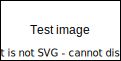

<script id="MathJax-script" src="https://cdn.jsdelivr.net/npm/mathjax@3.0.1/es5/tex-mml-chtml.js"></script>

<style>
.correction{
    //display:none;
}
</style>

<div class="header">
<div>ESIROI - CPI 1</div>
<div>E1CP2PS2 - Algorithmique et programmation 2</div>
<div>K. HOARAU</div>
</div>
<hr>
<div class="title">Rattrapage</div>
<hr>

<h1 class="correction center">*** Corrigé ***</h1>


### Nom : 
### Prénom : 
### Numéro étudiant : 

# Consignes 

* La tenue de votre copie sera évaluée sur 2 points.
* L'examen est évalué sur 23 points.

# Exercice 3  (6 pts)

1. Ecrire une fonction récursive qui calcule le terme d'indice \\(n\\) de la suite définie récursivement par :
* \\(u_0 = 5\\)
* \\(u_n = 2 ∗ u_{n−1} + 1\\) si \\(n > 0\\)
    :::correction
    ```python
    def suite_rec1(n):
        if n == 0:
            return 5
        else:
            return 2 * suite_rec1(n - 1) + 1
    ```
    :::


### Exemple math
        
$$\theta + an$$

\\[x = {-b \pm \sqrt{b^2-4ac} \over 2a}.\\]

* test \\(\theta\\)


<div class="bloc">
<h3><i class="fa-solid fa-circle-info"></i> L'objet Tensor (Source : Documentation de PyTorch)</h3>
<hr>
Tensors are similar to NumPy’s ndarrays, except that tensors can run on GPUs or other hardware accelerators. In fact, tensors and NumPy arrays can often share the same underlying memory, eliminating the need to copy data (see Bridge with NumPy). Tensors are also optimized for automatic differentiation (we’ll see more about that later in the Autograd section). If you’re familiar with ndarrays, you’ll be right at home with the Tensor API. If not, follow along!
</div>


<div class="center">

<div class="image_caption">Figure 2 - Représentation sous forme de graphe</div>
</div>